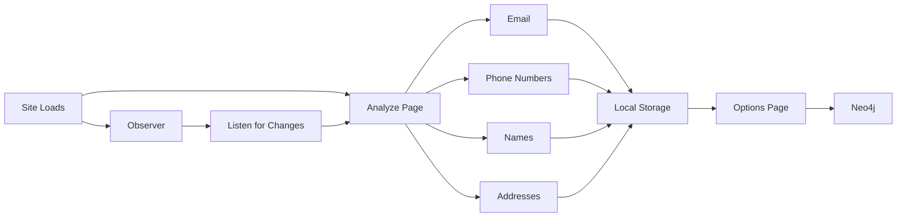
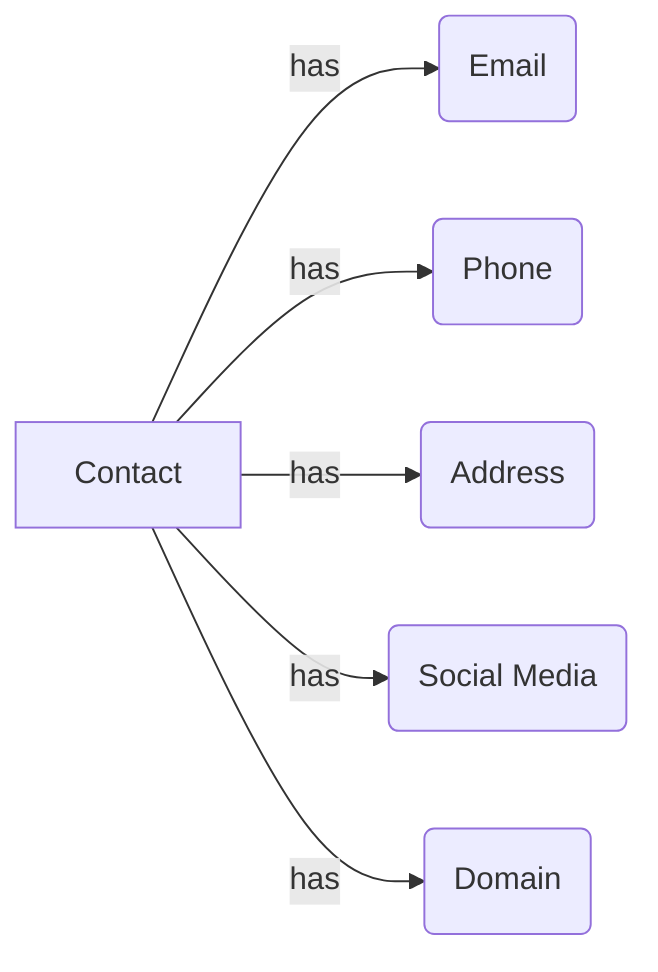

# OpenTrace

## Objective

The objective of this project is to create a tool that can take any web site, scan it for osint information. It is unique in that it doesn't need to know the structure of the site. It will first analyze the site, then use Observer to listen for any further changes. 

## Architecture

- Site Loads
  -  Analyze Page
     - Look at every element on the page for:
       - Email Addresses
       - Phone Numbers
       - Names
       - Addresses
   - Observer
     - Listen for any changes to the page
       - If a change is detected, analyze the change
       - If the change is a new page, analyze the page
       - If the change is a new element, analyze the element
       
make a mermaid graph of this



## Chrome Extension Architecture

### content.js

this is the most important file, responsible for analyzing the page and organizing the data into a json object.

Example:

```json
{
  "url": "https://www.example.com",
  "contacts": [
    {
      "name": "John Doe",
      "email":   [ "foo@example.com", "foo1@test.com" ],
      "phone": [ "123-456-7890", "098-765-4321" ]
    },
    {
      "name": "Jane Doe",
      "email":   [ "jane@example.com" ],
      "phone": [ "123-456-7890" ]
    },
    {
      "name": "John Smith",
      "email":   [ "john@test.com" ],
      "phone": [ "123-456-7890" ]
    }
  ]
}
```

This is the main file that is injected into the page. It is responsible for analyzing the page and sending the data to the 
the service-worker.js

### service-worker.js

This is the main file that is responsible for listening for messages from the content.js

### options.js

the options page will be used for a ui to display the data that is collected. a timeline of the sites visited will be displayed with a list of the data that was collected. A D3 graph of the the data will be displayed.

It will also be used to send the data to the neo4j database. local storage will be used to store the data until it is sent to the database.

other features such as filtering, searching, and exporting will be added.

### popup.js

the popup will be used to display the current status of the extension. it will also be used to display the current data that is stored in local storage. 

## Neo4j Architecture

### Nodes and Properties
 
Contact - a person or organization that is associated with the site
Address - a physical address
Email - an email address
Phone - a phone number
Domain - a domain name
Social Media - a social media account


### Relationships



### Cypher

```cypher
CREATE (n:Contact {name: "John Doe"})
CREATE (n:Email {email: "john@doe.com"})
CREATE (n:Phone {phone: "123-456-7890"})
CREATE (n:Address {address: "123 Main St"})
CREATE (n:SocialMedia {socialmedia: "facebook.com/johndoe"})
CREATE (n:Domain {domain: "facebook.com"})

MATCH (a:Contact),(b:Email)
WHERE a.name = "John Doe" AND b.email = "john@doe.com"
CREATE (a)-[r:HAS]->(b)

MATCH (a:Contact),(b:Phone)
WHERE a.name = "John Doe" AND b.phone = "123-456-7890"

MATCH (a:Contact),(b:Address)
WHERE a.name = "John Doe" AND b.address = "123 Main St"

MATCH (a:Contact),(b:SocialMedia)
WHERE a.name = "John Doe" AND b.socialmedia = "facebook.com/johndoe"

MATCH (a:Contact),(b:Domain)
WHERE a.name = "John Doe" AND b.domain = "facebook.com"

MATCH (a:Contact),(b:Email)
WHERE a.name = "John Doe" AND b.email = "john@doe.com"
CREATE (a)-[r:HAS]->(b)

MATCH (a:Contact),(b:Phone)
WHERE a.name = "John Doe" AND b.phone = "123-456-7890"
``` 
 

### Queries

#### Get all contacts
```cypher
MATCH (n:Contact)
RETURN n
```

#### Get all contacts with email
```cypher
MATCH (n:Contact)-[r:HAS]->(e:Email)
RETURN n, e
```

#### Get all contacts with phone
```cypher
MATCH (n:Contact)-[r:HAS]->(p:Phone)
RETURN n, p
```

#### all orphans
```cypher
MATCH (n)
WHERE NOT (n)--()
RETURN n
``` 

#### find all contacts where social media is facebook
```cypher
MATCH (n:Contact)-[r:HAS]->(s:SocialMedia)
WHERE s.socialmedia = "facebook.com"
RETURN n, s
```

#### find all contacts where social media is facebook and email is gmail
```cypher
MATCH (n:Contact)-[r:HAS]->(s:SocialMedia)
WHERE s.socialmedia = "facebook.com"
MATCH (n)-[r:HAS]->(e:Email)
WHERE e.email = "gmail.com"
RETURN n, s, e
``` 